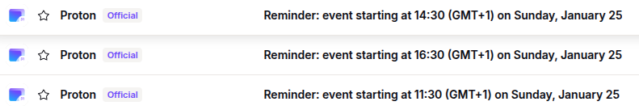

# What is this?
This is a bunch of backend helper scripts that patch Proton's rather non-descript calendar notification e-mails like "Reminder: event starting at 11:30 (GMT+1) on Sunday, January 25".
They largely do this because they claim to be unable to see user calendars as they are encrypted and can therefore not populate the e-mail.

**Before**
<p align="center">
  
</p>

**After**
<p align="center">
  
</p>

The fix here is rather ugly, but also relatively durable as we're just using the proton bridge + standard IMAP & SMTP e-mail APIs:
1. Fetch reminder e-mail
2. Fetch calendar events
3. Match event timestamp to the one in the e-mail
4. Send new e-mail with event title in heading
5. Scrap reminder e-mail

# Installation

## E-mail
1. Install Protonmail Bridge and a password manager.
```bash
sudo apt install fonts-dejavu fonts-dejavu-extra pass
wget https://proton.me/download/bridge/protonmail-bridge_3.13.0-1_amd64.deb
sudo dpkg -i protonmail-bridge_3.13.0-1_amd64.deb
```
2. Configure a GPG key on `pass`. Use either an existing key from `gpg --list-keys` or `gpg --full-generate-key`. Initialise it via `pass init <GPG_KEY>`
3. Run Protonmail Bridge CLI via `protonmail-bridge -c`
4. In the bridge CLI log into account via `login`.
5. After synchronisation finishes, run `info` to get the local e-mail server's credentials. Make sure to export these as environment variables as indicated in `mail_patcher.py`.

## Calendar
1. For each calendar in Proton's Calendar UI, set "Share with anyone" and copy the ICS URL. This is not ideal from a security standpoint, but otherwise we cannot fetch the file.
2. Put each calendar name and URL into a `calendar_urls.json`. E.g:
```json
{
    "calendar_name_1": "<ICS_URL_1>",
    "calendar_name_2": "<ICS_URL_2>"
}
```
## Project
1. Install the python version specified in `.python-version`.
2. Install requirements via `pip install -r requirements.txt`

## Development
In addition to the above, set up linting by running `pre-commit`


# Deploy systemd service
To setup the application as a service, use the `*.service` files (replace usernames and paths a needed).
1. Download this helper [bash script](https://gist.github.com/NiklasZ/0b5bb6f30ac2ad5d07b08b549cd061f9).
2. Allow the execution via `chmod +x deploy_service.sh`
3. Then for each service file use `deploy_service.sh <.service file>`
